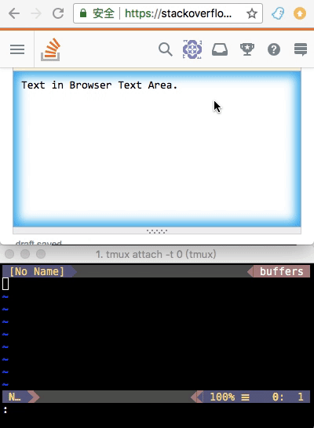

# ghost-text.vim

support for GhostText in vim:

refer to https://github.com/GhostText/GhostText

# install with vundle:

```
Plugin 'pandysong/ghost-text.vim'
```

Then 
```
:so %
:PluginInstall
```

Note that part of the plugin is written in Python3, so vim must be compiled with
Python3

running following to see if it supports Python3:
```
:py3 import vim; print("hello")
```

The plugin also needs `websockets` package:

```
python3 install -m pip websockets
```

Also note that vim must support `channel`, so better to use the latest vim.

# start ghost-text.vim

## start on vim side
```
:GhostTextStart
```

This will create a server for browser to connect. 

## click GhostText in a browser

Refer to https://github.com/GhostText/GhostText

Once a text editor box is selected, an buffer will be open in vim. Editing on
either one will synchronize with the other one.

## stop on vim side

```
:GhostTextStop
```

Note that if you need to save the buf to another file, one may need to issue
command explicitly:

```
:w another_file_name.txt
```

# log

Enable log:
```
:let g:ghost_text_log_file = "/Users/pandysong/ghost_log.txt"
```

live log could be viewed by:

```
tail -f /Users/pandysong/ghost_log.txt
```

disable log:
```
:unlet g:ghost_text_log_file
```

# todo 

- support automatic syntax
- for text with html tags, it would be better to map to/from markdown.

This is still a very preliminary version.
